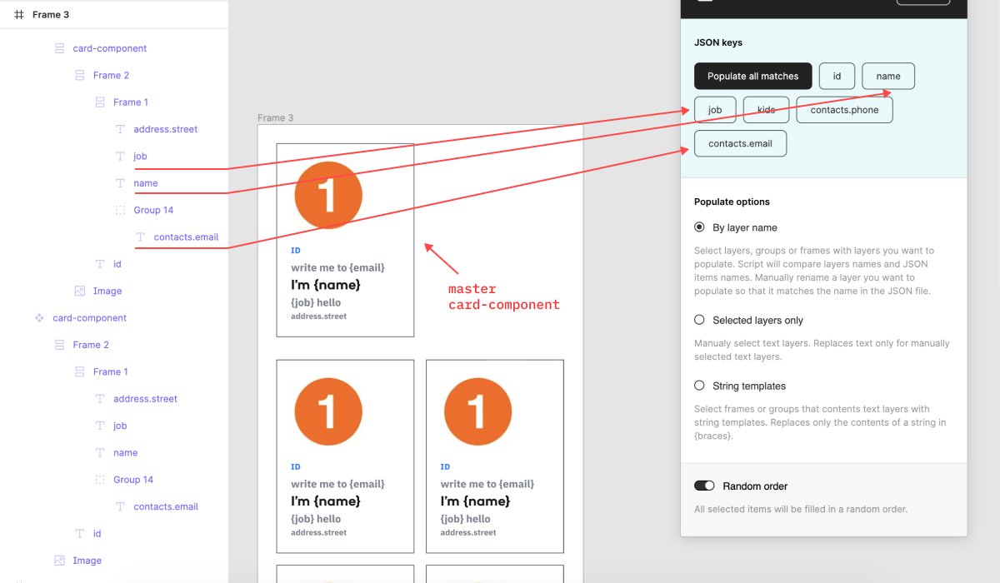
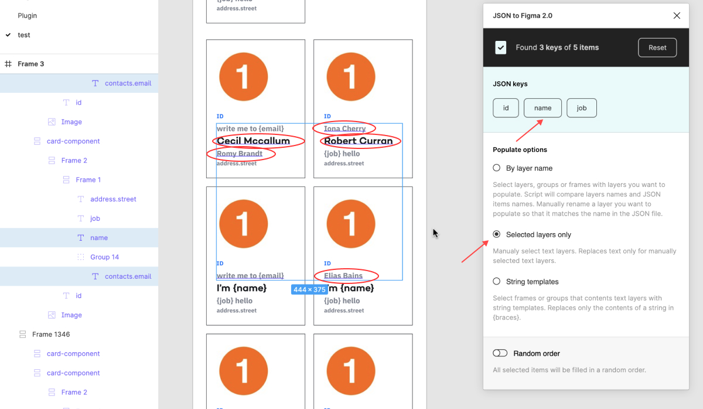
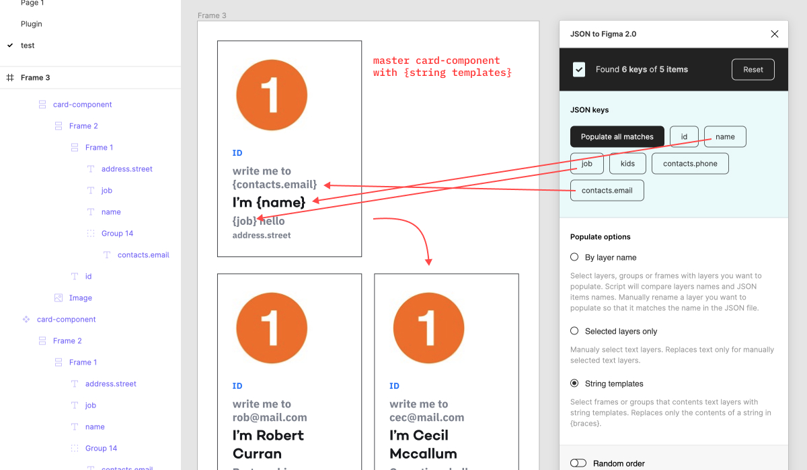

# JSON to Figma 2.5


An easy way to populate Figma layers with JSON.
The plugin can parse local or JSON files from URL link. You can populate text layers that you selected, or by name or string template.

#### Plugins' community page

[figma.com/community/plugin/789839703871161985/JSON-to-Figma](https://www.figma.com/community/plugin/789839703871161985/JSON-to-Figma)

#### Promo page

[pavellaptev.github.io/JSON-to-Figma](https://pavellaptev.github.io/JSON-to-Figma/promo/index.html)

#### Youtube demo

[youtu.be/f7AULw3xcG8](https://youtu.be/f7AULw3xcG8)

---

### 🎀 What's new in 2.5 version

-   Added **`Populate all matches`** button.
-   Fetch URL method updated
-   Refactored methods. New Object of objects parsing

---

### 💡 Features:

-   Load **loacl** files and fetch **from URL**
-   Parsing of JSON files with **any amount of nested levels**
-   Popualte **all matches** only by one button
-   Three populate options — populate **`only selected layers`**, **`by layer name`**, **`by string templates`**
-   Popualte **by direct or random order**

---

## 🚀 How to start

The plugin has main three populate options. Two of them are automatic options — select groups or frames that contain layers that you want to populate and the plugin will find match layers automatically.

### ⚙️ Populate Options

**1. `By layer name`** — You can populate layers deeply nested in any group or frame. To do so, manually rename the layer you want to populate so that it matches the name in the JSON file.
Not a case-sensitive method — a JSON item with a `job` name will be match to `Job` layer name.



**2. `Selected layers only`** — Replaces text only for directly selected text layers.



**3. `String templates`** — Select frames or groups that contents text layers with string templates. Replaces only the contents of a string in {braces}.



**4. `Random order`** — All selected items will be filled in a random order. By default all your layers will be filled in order.

---

### ✅ The correct JSON structure

The beeter JSON structure for the file should look like array of objects

```js
[
    {
        key_string: 'string #1',
        key_number: 0,
    },
    {
        key_string: 'string #2',
        key_number: 1,
    },
];

// As a result you will see buttons — `key_string`, `key_number`
```

##### ⚠️ Other JSON structures

But you also can use different JSON structures. For example:

```js
{
    "obj0": {
        "key_string": "string #1",
        "key_number": 0
    },
    "obj1": {
        "key_string": "string #2",
        "key_number": 1
    }
}

// As a result you will see buttons — `0`, `1.key_string`, `1.key_number`
```

### 📓 Services to generate JSON data

You can download try different JSON samples [from this repo](https://github.com/PavelLaptev/JSON-to-Figma-2.0-React/tree/master/json-test-files).

Or you can use on of these services:

-   [mockaroo.com](https://www.mockaroo.com/)
-   [next.json-generator.com](https://next.json-generator.com/EyLps-PPO?fbclid=IwAR0WGNKJMclqcS6qwRHj-NXOyF52BjQYJp9osgeWRmN2iCGZ47awnDDLhmI)
-   [jsonplaceholder.typicode.com](https://jsonplaceholder.typicode.com/)

---

### 🤙 Feedback

Please if you have any trubles with the plugin or ideas how I could improve the plugin, let me know here or by email 😊

---

#### Original boilerplate repo

[github.com/nirsky/figma-plugin-react-template](https://github.com/nirsky/figma-plugin-react-template)
