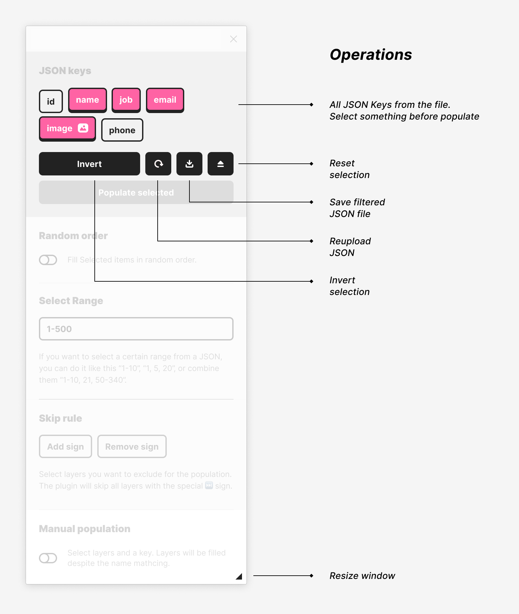

# JSON to Figma 4.2


##### An easy way to use real data in Figma.

The plugin can parse local or JSON files from a URL link. You can populate any layers with text or images.

---

### 💡 Features:

-   Load **local** files and fetch **from URL**
-   Fetch images
-   Parsing JSON files with **any amount of nested levels**
-   **Flexible** keys selection
-   **Invert** selected keys
-   **Download** filtered JSON
-   Populate **in random order**
-   Manual Popualtion
-   Select any **ranges** from JSON file
-   the **"skip" rule** for layers you won't populate
-   Handle `null` values
-   Resizable plugin window

---

### Get the plugin

##### 📥 [figma.com/community/plugin/789839703871161985/JSON-to-Figma](https://www.figma.com/community/plugin/789839703871161985/JSON-to-Figma)

### Youtube demo

##### 🎥 [youtu.be/7CKYdDfLFDY](https://youtu.be/J9Hu2hNSWvE)

---

## 🚀 How to Use

All you need is a [proper JSON](#-valid-json-structure). The plugin will parse show all available keys from the JSON including nested layers.



1. Load a JSON file localy or copy a link and the click on the "From Cipboard link" button.
2. Make sure layers you want to populate have the same names as in the JSON file. For example — if you see a key "user.name" key in the plugin the layer name also should be "user.name".
3. Select layers with items you want to populate. You can select group or frames with these layers, no need to select layers dirictly or manualy, the plugin will find them by their names.
4. Select keys you want to use for population.
5. Press "Populate selected" button

---

### 🤘 Features

**`Range seection`** — If you want to select a certain range from a JSON, you can do it like this “1-10”, “1, 5, 20”, or combine them “1-10, 21, 50-340” — it means that the plugin will take JSON objects from 1 to 10, 21 and from 50 to 340 and combine them into one new array. Then you can also **save filtered array**.

**`Skip marked layers`** — if you want to skip layers, groups or frames — exclude them from the list, then you can use the “Skip marked layers” option. Just select layers and press “Skip selected”. You can also clean marked layers or add the marker manually.

**`Random order`** — If you switch it on all items will be filled in a random order. By default, all your layers will be filled in order.

**`Image URLs recognition`** — The plugin will automaticly recognise values from a JSON that end with .JPG, .PNG, .GIF or .WEBP as images. if you name a shape or a frame with the name of the key — the pllugin wil fetch the image by URL and add it as a fill.

**`Manual population`** — The plugin populates layers automatically by their names. But you can populate layers manually, despite their names. Select a key in the plugin and then select layers you want to populate. Acceptable for images also.

---

### ✅ Valid JSON structure

The JSON structure for the file should look like an array of objects.

```json
[
    {
        "id": 1,
        "name": "Shannah Judgkins",
        "job": "Database Administrator II",
        "image": "https://robohash.org/suntautvoluptatem.jpg?size=500x500&set=set1"
    },
    {
        "id": 2,
        "name": "Silvester Hallwell",
        "job": "Data Coordiator",
        "image": "https://robohash.org/rerumautemenim.jpg?size=500x500&set=set1"
    }
]
```

---

### 📓 Services to generate JSON data

You can download try different JSON samples [from this repo](https://github.com/PavelLaptev/JSON-to-Figma-2.0-React/tree/master/json-test-files).

Or you can use on of these services:

-   [mockaroo.com](https://www.mockaroo.com/)
-   [next.json-generator.com](https://next.json-generator.com/EyLps-PPO?fbclid=IwAR0WGNKJMclqcS6qwRHj-NXOyF52BjQYJp9osgeWRmN2iCGZ47awnDDLhmI)
-   [jsonplaceholder.typicode.com](https://jsonplaceholder.typicode.com/)

---

### 🤙 Feedback

Please if you have any trubles with the plugin or ideas how I could improve the plugin, let me know here or by email 😊

---

### [🧑‍💻💸 Support plugin](https://www.paypal.com/paypalme/pavellaptev)
